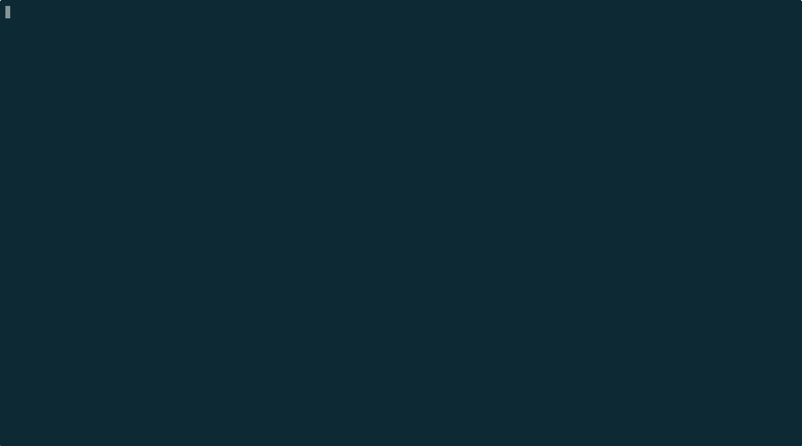

# BINARY DUNGEON

A tactical TUI roguelike where you debug bugs, ship code, and try not to burn out.

Built for short play sessions in the terminal.

```
 ____  _                        ____
| __ )(_)_ __   __ _ _ __ _   _|  _ \ _   _ _ __   __ _  ___  ___  _ __
|  _ \| | '_ \ / _` | '__| | | | | | | | | | '_ \ / _` |/ _ \/ _ \| '_ \
| |_) | | | | | (_| | |  | |_| | |_| | |_| | | | | (_| |  __/ (_) | | | |
|____/|_|_| |_|\__,_|_|   \__, |____/ \__,_|_| |_|\__, |\___|___/|_| |_|
                           |___/                    |___/
```



## Install

Download a prebuilt binary for your platform from [Releases](https://github.com/henteko/binary-dungeon/releases).

| File | Platform |
|------|----------|
| `bd-darwin-arm64` | macOS (Apple Silicon) |
| `bd-darwin-x64` | macOS (Intel) |
| `bd-linux-x64` | Linux (x86_64) |
| `bd-linux-arm64` | Linux (ARM64) |

```bash
chmod +x bd-darwin-arm64
mv bd-darwin-arm64 bd
./bd
```

### From source

Requires [Bun](https://bun.sh/).

```bash
bun install
bun run dev
```

## Controls

| Key | Action |
|-----|--------|
| `WASD` / `hjkl` / Arrows | Move |
| `1` | Debug (single attack, low MH cost) |
| `2` | Hotfix (heavy attack, stunned next turn) |
| `3` | Google It (reveal area + enemy info, DL cost) |
| `4` | Refactor (defense up + MH heal, DL cost) |
| `Space` / `.` | Wait a turn |
| `q` | Quit |

## How to Play

You are a developer (`@`) navigating a dungeon of bugs. Each floor has a set of enemies to defeat and a staircase (`>`) to the next milestone.

**Goal:** Kill all bugs on the floor, then reach the stairs to advance.

### Resources

- **MH (Mental Health):** Your HP. Drops from enemy attacks and burnout. Reaches 0 = game over.
- **DL (Deadline):** Decreases by 1 every turn. When DL hits 0, **Burnout Mode** activates: enemies deal 1.5x damage and you take 2 MH stress damage per turn.

### Actions

| Action | Cost | Effect |
|--------|------|--------|
| Debug | 5 MH | Deal 10 damage to an adjacent bug |
| Hotfix | 15 MH | Deal 30 damage, but you're stunned next turn |
| Google It | 5 DL | Reveal nearby tiles and show enemy stats |
| Refactor | 3 DL | Reduce incoming damage by 50% this turn, heal 5 MH |

### Enemies (Bugs)

| Bug | Symbol | HP | ATK | XP |
|-----|--------|----|-----|----|
| Segfault | `S` | 15 | 8 | 10 |
| NullRef | `N` | 10 | 5 | 7 |
| OffByOne | `O` | 8 | 3 | 5 |
| RaceCondition | `R` | 20 | 10 | 15 |
| MemoryLeak | `M` | 25 | 6 | 12 |
| InfiniteLoop | `I` | 12 | 7 | 8 |

Enemies chase you within range 10 and attack when adjacent.

### Items

Items spawn on each floor. Walk over them to pick up instantly.

| Item | Symbol | Effect |
|------|--------|--------|
| Coffee | `c` | Restore 15 MH |
| Pizza | `p` | Restore 35 MH |
| Red Bull | `r` | Restore 20 MH + 1.5x attack for 5 turns (crash: -10 MH when expired) |
| Mech Keyboard | `K` | 1.4x attack for 6 turns |
| NC Headphones | `H` | 0.4x incoming damage for 6 turns |
| sudo | `$` | Next attack deals 3x damage |

Multiple attack buffs stack multiplicatively.

### Milestones

Clear floors to advance through milestones (v1.0.0 -> v1.1.0 -> ... -> v3.0.0). Each milestone increases enemy count, HP, and attack power. Clearing a milestone restores your Deadline.

## Meta-Progression

When you die, XP earned across all runs is preserved. Invest it in **Tech Stacks** to power up future runs:

| Stack | Effect |
|-------|--------|
| Python | -10% MH cost for Debug per level |
| C++ | +15% Hotfix damage per level |
| Rust | +10% Refactor defense per level |
| Go | -10% DL cost for Google It per level |

Each stack has a max level of 10. As your total stack levels increase, your title progresses: Junior -> Mid-level -> Senior -> Lead -> Architect.

## Save Data

Supports 3 save slots. Data is saved to `~/.binary-dungeon/slot{1,2,3}.yaml` with HMAC-SHA256 tamper detection. Editing the save file is detected and permanently sets your title to "Script Kiddie".

## Recording

Use [asciinema](https://asciinema.org/) to record gameplay:

```bash
asciinema rec -c "bun run dev" gameplay.cast
```

Play it back:

```bash
asciinema play gameplay.cast
```

## Build

```bash
bun run build     # Build with Vite
bun run start     # Run built output
```

## Tech Stack

- TypeScript (strict)
- Bun
- Vite (SSR build)
- @opentui/core (TUI framework)
- BSP dungeon generation
- Shadowcasting FOV

